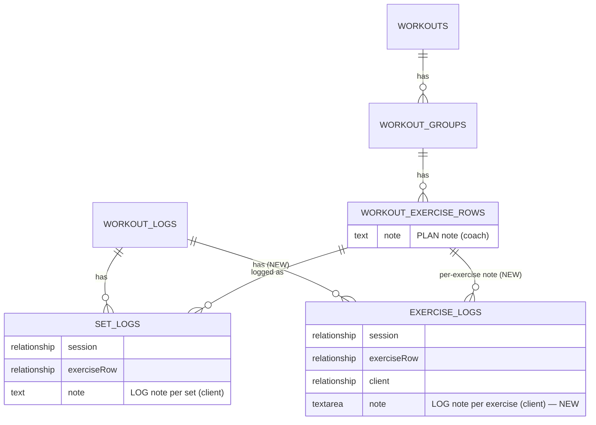
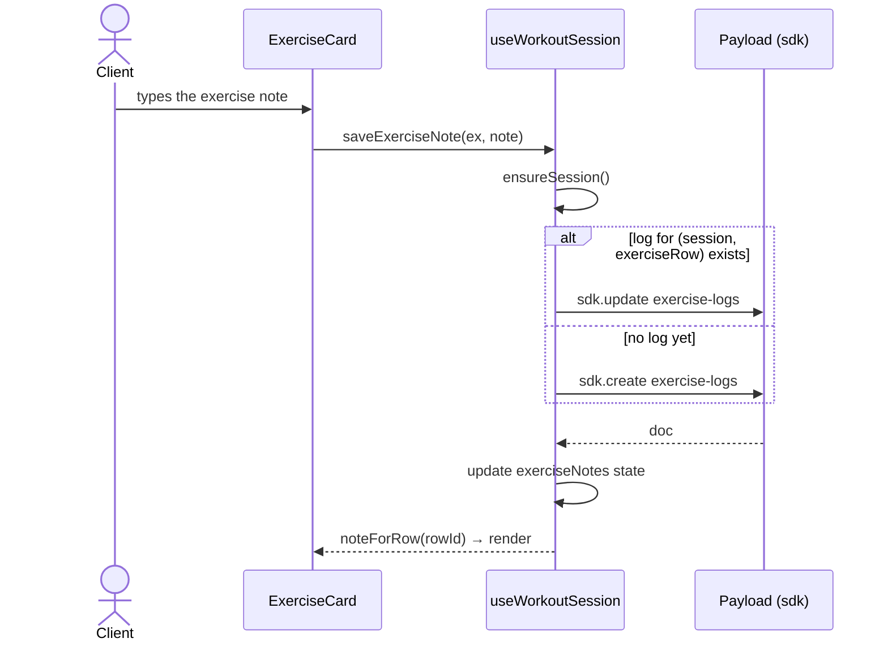

# Client note for the whole exercise (`exercise-logs`)

**Date:** 2026-06-20
**Status:** draft
**Area:** backend + admin/frontend (Payload CMS / Next.js)

---

## TLDR

Today a client can only add a note **per set** (`set-logs.note`). We add a new log collection **`exercise-logs`** that stores **one client note for the whole exercise within a session** — symmetric to `set-logs`, but at the exercise level (`workout-exercise-rows`) rather than a single set.

---

## Open Questions

> All key decisions were resolved during the requirements discussion. No blocking open questions remain.

- ~~Layer: plan vs log?~~ → **log** (client note, not a coach template).
- ~~Level: set / group / exercise?~~ → **exercise** (`workout-exercise-rows`).
- ~~Data location: field on `workout-logs` vs new collection?~~ → **new collection `exercise-logs`** (Option B — normalized, consistent with `set-logs`).

---

## Problem Statement

In the workout tracker a client logs exercise execution as sets (`set-logs`). Each set can have its own note (`set-logs.note`, the field in [SeriesForm](../../src/components/workout/series-form/series-form.tsx)). What is missing is a note **for the whole exercise** — an annotation like "shoulders felt weak today, lower the weight next time" that applies to the exercise as a whole, not to one specific set.

The note cannot live in the plan: `workout-exercise-rows` has `update: isAdmin` — clients do not write to the template. It must therefore be created in the log layer, tied to the **(session, exercise)** pair.

Disambiguating the existing "notes" (the source of confusion):

| Note | Entity | Author | Scope |
|---|---|---|---|
| Plan note — exercise | `workout-exercise-rows.note` | coach | exercise template |
| Log note — set | `set-logs.note` | client | one set |
| **Log note — exercise** | **`exercise-logs.note` (NEW)** | **client** | **whole exercise in a session** |

---

## Proposed Solution

A new `exercise-logs` collection in the log layer, modeled on [set-logs](../../src/collections/set-logs/index.ts): a `session` + `exerciseRow` + `client` + `note` relationship. One note per exercise per session (enforced via an **upsert** pattern in the UI). The tracker loads the notes together with sets, and `ExerciseCard` displays and edits the note in the exercise header (not in the set form).

### Diagram — data model (plan layer vs log layer)



### Diagram — save flow (upsert in the tracker)



---

## Architecture

Layers: **Collection (model + access + hooks) → SDK (mutation in a React hook) → UI component**. No custom endpoints — we use Payload's REST/SDK (same as `set-logs`).

### File Structure

```
src/
├── collections/
│   ├── exercise-logs/
│   │   └── index.ts                  # NEW collection
│   └── index.ts                      # + re-export ExerciseLogs
├── payload.config.ts                 # + register in collections[]
├── components/workout/
│   ├── workout-tracker/
│   │   ├── workout-tracker.tsx       # pass note + onSaveNote to the card
│   │   └── hooks/
│   │       └── use-workout-session.ts # load + noteForRow + saveExerciseNote
│   └── exercise-card/
│       └── exercise-card.tsx         # render + edit the exercise note
├── types/workout.ts                  # log-note type (optional)
├── scripts/export-seed.ts            # + ExerciseLogs to the skip list
└── migrations/
    └── YYYYMMDD_*.ts                 # new exercise_logs table
messages/
├── pl.json                           # UI strings
└── en.json
```

---

## Data Models

### `exercise-logs` collection

| Field | Type | Required | Notes |
|---|---|---|---|
| `session` | relationship → `workout-logs` | yes | training session |
| `client` | relationship → `clients` | no | `defaultValue` from user (as in set-logs) |
| `exerciseRow` | relationship → `workout-exercise-rows` | yes | exercise key |
| `exercise` | relationship → `exercises` | no | catalog snapshot (reporting) |
| `note` | textarea | no | note body |

**Uniqueness `(session, exerciseRow)`** — one note per exercise per session. Enforced via the upsert pattern in the UI (find → update / create); optionally hardened with a `beforeValidate` hook that rejects duplicates.

**Access** (copy of the [set-logs](../../src/collections/set-logs/index.ts) pattern):

| Operation | Rule |
|---|---|
| create | `({ req:{user} }) => Boolean(user)` |
| read | `adminOrOwnByClient` → fallback `canReadViaShareToken` |
| update | `adminOrOwnByClient` |
| delete | `adminOrOwnByClient` |

**Hooks:**
- `beforeChange`: for `user.collection === 'clients'` set `data.client = req.user.id` (ID from the user session, never from the request).
- `beforeValidate`: validate `session` ownership (a client cannot log to someone else's session) — analogous to [set-logs.beforeValidate](../../src/collections/set-logs/index.ts).

**Admin:** `group: 'Training log'`, `useAsTitle: 'id'`, `defaultColumns: ['exerciseRow', 'session', 'client']`.

---

## API Contracts

No custom routes. Operations go through the Payload SDK (`@/lib/sdk`) on the `exercise-logs` collection:

```
sdk.find({ collection: 'exercise-logs', where: { session: { equals: sessionId } } })
sdk.create({ collection: 'exercise-logs', data: { session, exerciseRow, exercise?, note } })
sdk.update({ collection: 'exercise-logs', id, data: { note } })
```

Access control and the `client` assignment are enforced by the collection's access rules + hooks (not by the UI layer).

---

## Workflow Design

```
useWorkoutSession (hook)
├── [load]   sdk.find workout-logs (session)       — exists
├── [load]   sdk.find set-logs by session          — exists
├── [load]   sdk.find exercise-logs by session     — NEW → exerciseNotes state
├── [select] noteForRow(rowId)                      — NEW (analogous to setsForRow)
└── [mutate] saveExerciseNote(ex, note)             — NEW
            ├── ensureSession()
            ├── upsert: update if exists, otherwise create
            └── update local state
```

UI: [workout-tracker.tsx](../../src/components/workout/workout-tracker/workout-tracker.tsx) passes `note` + `onSaveNote` to [exercise-card.tsx](../../src/components/workout/exercise-card/exercise-card.tsx), which renders the note in the exercise header (distinct from the plan note) and — when `!readOnly` — exposes an editable field.

---

## Phasing

### Phase 1 — Backend (collection + migration)
The `exercise-logs` collection, registration, access/hooks, migration, types. **Deliverable:** the exercise note can be created/edited via the admin and the SDK; `yarn build` passes.

### Phase 2 — Runtime (session hook)
Loading `exercise-logs`, `noteForRow`, `saveExerciseNote` (upsert). **Deliverable:** note data is available in the tracker (logic ready, no UI yet).

### Phase 3 — UI + i18n
Render and edit the note in `ExerciseCard`, strings in `pl.json`/`en.json`, visibility in read-only/share mode. **Deliverable:** a client can add/edit the exercise note in the app.

---

## Implementation Plan

### Phase 1 — Backend
- [ ] Create `src/collections/exercise-logs/index.ts` (fields, access, hooks per the Data Models section).
- [ ] Re-export in [src/collections/index.ts](../../src/collections/index.ts).
- [ ] Register in `collections[]` in [src/payload.config.ts](../../src/payload.config.ts).
- [ ] `yarn payload migrate:create` → `exercise_logs` table; then `yarn payload migrate`.
- [ ] `yarn generate:types` → `ExerciseLog` type.
- [ ] `yarn build`.

### Phase 2 — Runtime
- [ ] [use-workout-session.ts](../../src/components/workout/workout-tracker/hooks/use-workout-session.ts): load `exercise-logs` by `session`, add `exerciseNotes` state.
- [ ] Add the `noteForRow(rowId)` selector and the `saveExerciseNote(ex, note)` mutation (upsert).
- [ ] Expose both in the hook's returned API.

### Phase 3 — UI + i18n
- [ ] [workout-tracker.tsx](../../src/components/workout/workout-tracker/workout-tracker.tsx): pass `note` + `onSaveNote` to `ExerciseCard`.
- [ ] [exercise-card.tsx](../../src/components/workout/exercise-card/exercise-card.tsx): render the client note in the header + allow editing when `!readOnly`.
- [ ] Strings (label, placeholder, save) in `messages/pl.json` + `messages/en.json`.
- [ ] [export-seed.ts](../../src/scripts/export-seed.ts): add `ExerciseLogs` to the skip list.
- [ ] `yarn build` + verify in share (read-only) mode.

---

## Risks & Impact

| Risk | Severity | Mitigation |
|------|----------|-----------|
| Duplicate notes for `(session, exerciseRow)` on a race condition | medium | Upsert in the UI + optional `beforeValidate` hook rejecting duplicates |
| Notes leaking between clients | high | `adminOrOwnByClient` access; `client` set in `beforeChange` from `req.user.id`, never from the request |
| Log note confused with the plan note in the UI | low | Visual distinction in `ExerciseCard` (separate style/label) |
| Notes missing in the share view | medium | `read` with `canReadViaShareToken` fallback; verify in read-only mode |

---

## Compliance Review — Payload CMS / Next.js

| Rule | Status | Notes |
|------|--------|-------|
| New collection registered in `payload.config.ts` and exported from `collections/index.ts` | ✅ | Phase 1 |
| Migration generated (`migrate:create`) and applied (`migrate`) | ✅ | Phase 1 |
| `yarn generate:types` after schema change | ✅ | Phase 1 |
| `overrideAccess: true` only in server-side loaders, never in client handlers | ✅ | Tracker uses `sdk` with the logged-in client's permissions — no `overrideAccess` |
| Sensitive IDs (client) sourced from the DB doc, not the request | ✅ | `client` set in `beforeChange` from `req.user.id` |
| All 4 access operations (create/read/update/delete) defined | ✅ | Access section |
| Custom admin components in importMap (`generate:importmap`) | N/A | No new admin components |
| `yarn build` after each phase | ✅ | Covered in the plan |
| User-facing strings only via i18n (`pl.json` + `en.json`) | ✅ | Phase 3 |

**Verdict:** APPROVED — all rules pass or are N/A with justification.

---

## Changelog

| Date | Author | Change |
|------|--------|--------|
| 2026-06-20 | Krzysztof Polak | Initial draft (Option B — `exercise-logs` collection) |
